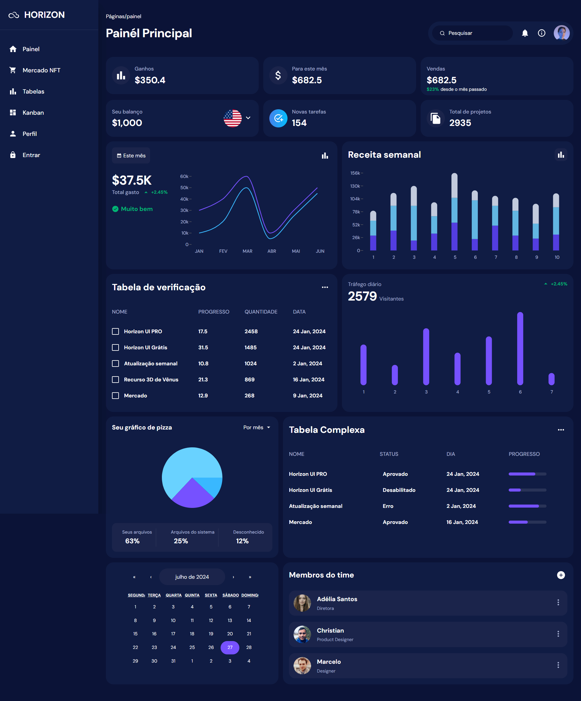

<a href="">Horizon deshboard</a>

Bem-vindo ao projeto Horizon Dashboard! Este projeto demonstra um design de dashboard moderno implementado usando React, styled-components e Recharts. Inclui vários componentes, estilos e gerenciamento de estado usando Redux.
 

👨🏼‍💻 <b>Tecnologias utilizadas:</b>

&nbsp;
&nbsp;
&nbsp;
&nbsp;

👨🏼‍💻 <b>Recursos:</b>

- Design modular e reutilizável com styled-components.
- Visualização de dados com Recharts.
- Gerenciamento de estado com Redux.
- Estrutura de código organizada e limpa.  

# React + Vite

Este modelo fornece uma configuração mínima para fazer o React funcionar no Vite com HMR e algumas regras ESLint.

Atualmente, dois plugins oficiais estão disponíveis:

- [@vitejs/plugin-react](https://github.com/vitejs/vite-plugin-react/blob/main/packages/plugin-react/README.md) uses [Babel](https://babeljs.io/) for Fast Refresh
- [@vitejs/plugin-react-swc](https://github.com/vitejs/vite-plugin-react-swc) uses [SWC](https://swc.rs/) for Fast Refresh
